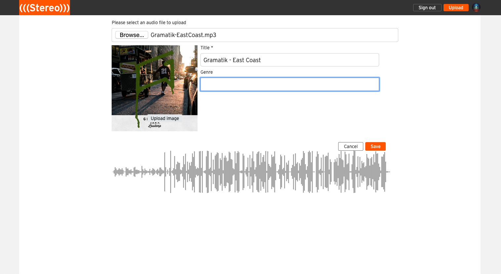
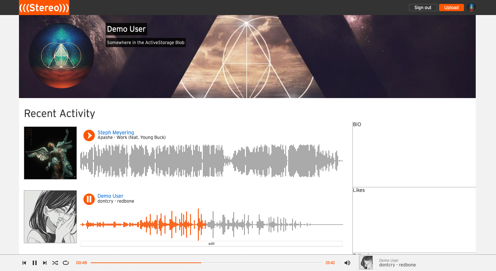

# README

Stereo is an online music streaming application, inspired by Soundcloud. 
The goal of this project was to build an app from scratch in a 2 week timeframe, without using any external libraries.

[See it live!](https://stereocloud.herokuapp.com/#/)

## Technologies Used:

- React: frontend components
- Redux: frontend state
- Rails: backend management
- AWS S3: music and photo storage
- PostgreSQL: database
- Heroku: app/db hosting
- BCrypt: password encryption/decryption
- Wavesurfer.js: waveform rendering

---

## Project Highlights:

### Play Controls React Component


* **Continuous playback while navigating through the app:** <br>
Selecting a song triggers the play controls nav bar to appear and stick to the bottom of the window. This component has it's own slice of state and will go uninterrupted even if user navigates to a different page of the app. <br>
* **Asynchronous song fetching:** <br>
The audio file is asynchronously fetched from AWS and loaded into the play controls audio element. 
* **Custom built media controls:** <br>
The song progress bar and audio controls were built from scratch to allow actions like seeking to affect elements from other components.

### Waveform component and two-way sync


The "current song" reducer handles most of the logic for syncing the audio playback with the waveform.
* SELECT_SONG can be dispatched by any of the song components (song_index_item || song_splash_item). Its payload is the song data which is loaded into the PlayControls Component.
* PLAY_PAUSE_SONG quite simply flips a boolean in it's slice of state, triggering other components also displaying the selected song to update accordingly.
* SEEK is a bit more interesting: 
  * It is dispatched via on click event listeners on the waveform and the progress bar. The payload contains the action's origin and the position at which to seek to.
  * The componentDidUpdate() lifecycle method inside the waveform and playControls components use this data to catch up to whichever component dispatched the seek action.
  * Any non "SEEK" action resets the ["seek"] key in the next state.

```js
// current_song_reducer.js

import { SELECT_SONG, PLAY_PAUSE_SONG, SEEK } from "../actions/current_song_actions";

const currentSongReducer = (state = null, action) => {
  Object.freeze(state);
  let nextState = Object.assign({}, state);
  switch (action.type) {
    case SELECT_SONG:
      nextState["id"] = action.song.id;
      nextState["artist"] = action.song.artist;
      nextState["fileUrl"] = action.song.fileUrl;
      nextState["title"] = action.song.title;
      nextState["photoUrl"] = action.song.photoUrl;
      nextState["playing"] = true;
      nextState["seek"] = false;
      return nextState;
    case PLAY_PAUSE_SONG:
      nextState["playing"] = nextState["playing"] === true ? false : true;
      nextState["seek"] = false;
      return nextState;
    case SEEK:
      nextState["seek"] = {
        origin: action.origin,
        position: action.position,
      };
      return nextState;
    default:
      // reset any existing "seek" state,
      if (nextState["seek"]) {
        nextState["seek"] = false;
        return nextState;
      } else {
        return state;
      }
  }
};

export default currentSongReducer;
```

### Song Uploads



#### **Waveform peak data caching**

#### **Album art preview**

#### **Song waveform preview**

### User Profiles



User profile page in progress.

### Waveform peak data calculation and storage on upload

Waveforms are generated using the Wavesurfer.js package.

---

## Features for future development:
- Song Comments (IN PROGRESS)
- User Profile side bar component 
- Playlists
- Song sharing
- Song likes
- ~~Add song delete functionality to front end~~ DONE
- Add song upload progress bar and completion / failure messages
- ~~Add song upload file size limit~~ DONE
- Google OAuth and Facebook Login
- Captcha for new account creation

